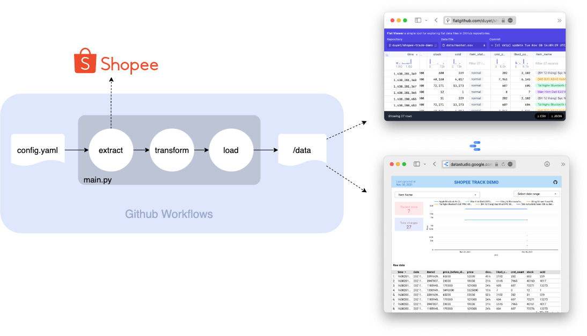
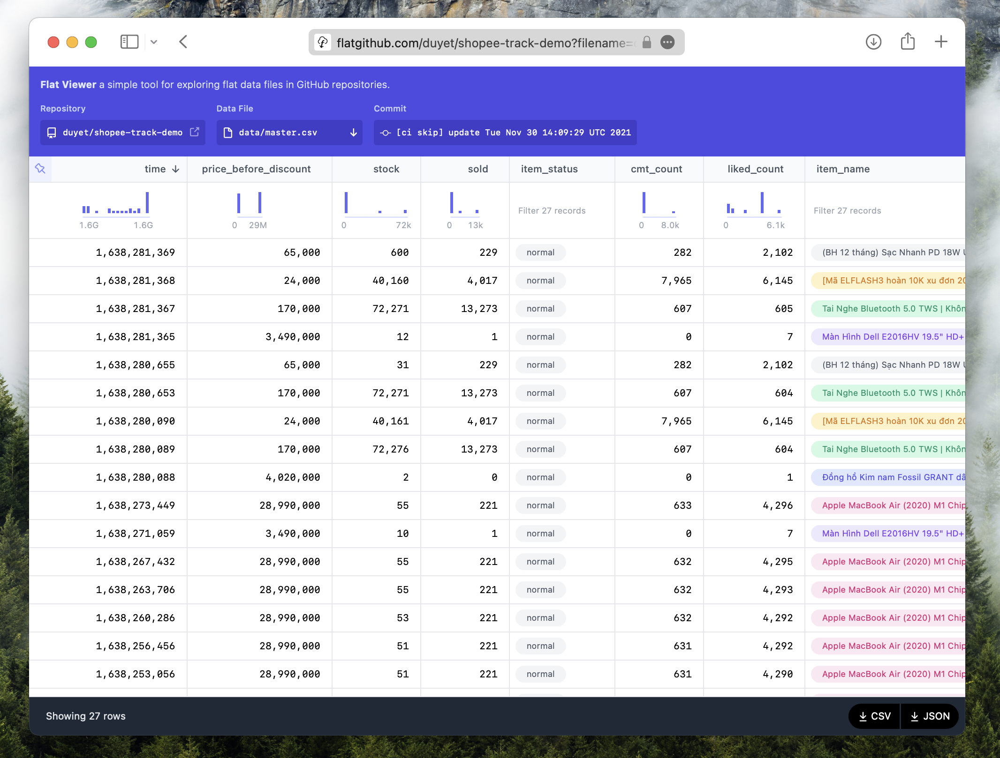
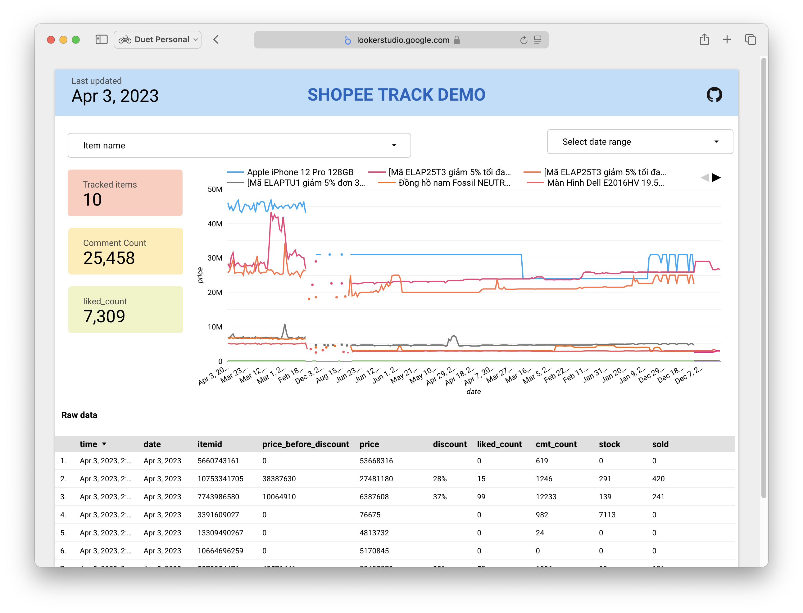

# Data Collector Demo

[](https://github.com/duyet/shopee-track-demo/actions/workflows/cronjob.yaml)

**[How it works?](#how-it-works)** |
**[Shopee Dataset Viewer](https://flatgithub.com/duyet/shopee-track-demo?filename=data%2Fmaster.csv&sha=d2f8a9914c69056b3b5cd418425c790ba24b464f)** |
**[Data Studio Dashboard](https://datastudio.google.com/reporting/c4e332ca-d94a-45e3-882c-b56f96e04c50)**

This repo is a demo of my presentation at University, intended to be run on a Github Workflows schedule, retrieving data from Shopee.vn
and creating a commit if there is any change to the fetched data into `./data/` folder.

This demonstrate offer a simple pattern for working on small data project that you can collect, process
and store datasets into your repositories and versioning them.

Data is collected and stored changes to the `data` folder **every 30 minutes** with `cron: "0,30 * * * *"` (see: [.github/workflows/cronjob.yaml](https://github.com/duyet/shopee-track-demo/blob/master/.github/workflows/cronjob.yaml).

# How it works?



<!-- Draw.io source: https://app.diagrams.net/#G186E1MfMGSuhpoQl6bvcvjuhTuOlBIHx1 -->

Github Workflows is located at [.github/workflows/cronjob.yaml](.github/workflows/cronjob.yaml),
it runs the `main.py` script every hour.

The script will:

1. First, reading the configuration from `config.yaml` (see: [What is YAML?](https://www.redhat.com/en/topics/automation/what-is-yaml))

```yaml
urls:
  - https://shopee.vn/Apple-MacBook-Air-(2020)-M1-Chip-13.3-inch-8GB-256GB-SSD-i.88201679.5873954476
  - https://shopee.vn/Đồng-hồ-nam-Fossil-NEUTRA-CHRONO-dây-da-FS5381-màu-đen-i.318790862.10664696259
  - https://shopee.vn/Apple-iPhone-13-128GB-i.88201679.10753341705
```

2. For each url in `urls`, it will try to parse url to get `itemid` and `shopid`

3. Call the Shopee API to get the JSON data: https://shopee.vn/api/v4/item/get?itemid=5873954476&shopid=88201679

```json
{
  "data": {
    "itemid": 3391609027,
    "shopid": 85794847,
    "userid": 0,
    "price_max_before_discount": 19900000000,
    "has_lowest_price_guarantee": false,
    "price_before_discount": 6500000000,
    "price_min_before_discount": 6500000000,
    "exclusive_price_info": null,
    "hidden_price_display": null,
    "price_min": 5000000000,
    "price_max": 12400000000,
    "price": 5000000000,
    "stock": 31,
    "discount": "50%",
    "historical_sold": 729,
    "sold": 229,
    "show_discount": 50,
    "raw_discount": 50,
    "min_purchase_limit": 0,
    "overall_purchase_limit": {
      "order_max_purchase_limit": 0,
      "overall_purchase_limit": null,
      "item_overall_quota": null,
      "start_date": null,
      "end_date": null
    },
    "pack_size": null,
    "is_live_streaming_price": null,
    "name": "(BH 12 tháng) Sạc Nhanh PD 18W USB-C To Lightning, Sạc 8,X,11,12,13 (Củ Sạc Nhanh PD 18W + Cáp Sạc Nhanh PD)",
    "ctime": 1623402573,
    "item_status": "normal",
    "status": 1,
    "condition": 1,
    "catid": 100013,
    "description": "....",
    "is_mart": false,
    "show_shopee_verified_label": true,
    "size_chart": null,
    "reference_item_id": "",
    "brand": null,
    "item_rating": {
      "rating_star": 4.890070921985815,
      "rating_count": []
    },
    "label_ids": [],
    "attributes": [],
    "liked": false,
    "liked_count": 2102,
    "cmt_count": 282,
    "flag": 2,
    "shopee_verified": true,
    "is_adult": false,
    "is_preferred_plus_seller": true,
    "bundle_deal_id": 0,
    "can_use_bundle_deal": false,
    "add_on_deal_info": {
      "add_on_deal_id": 5687796,
      "add_on_deal_label": "Mua Kèm Deal Sốc",
      "sub_type": 0,
      "status": 1
    },
    "bundle_deal_info": null,
    "can_use_wholesale": false,
    "wholesale_tier_list": [],
    "is_group_buy_item": null,
    "group_buy_info": null,
    "welcome_package_type": 0,
    "welcome_package_info": null,
    "tax_code": null,
    "invoice_option": null,
    "complaint_policy": null,
    "image": "2c3eb5d46df5721d7d1b64cfdb0d4c6c",
    "video_info_list": null,
    "item_type": 0,
    "is_official_shop": false,
    "show_official_shop_label_in_title": false,
    "shop_location": "Hà Nội",
    "coin_earn_label": null,
    "cb_option": 0,
    "is_pre_order": false,
    "estimated_days": 2,
    "badge_icon_type": 0,
    "show_free_shipping": true,
    "shipping_icon_type": 0,
    "cod_flag": 0,
    "show_original_guarantee": false,
    "other_stock": 577,
    "item_has_post": false,
    "discount_stock": 31,
    "current_promotion_has_reserve_stock": true,
    "current_promotion_reserved_stock": 31,
    "normal_stock": 570,
    "brand_id": 0,
    "is_alcohol_product": false,
    "show_recycling_info": false,
    "coin_info": {
      "spend_cash_unit": 100000,
      "coin_earn_items": []
    },
    "spl_info": {
      "installment_info": null,
      "user_credit_info": null,
      "channel_id": null,
      "show_spl": false,
      "show_spl_lite": true
    },
    "preview_info": null,
    "presale_info": null,
    "is_cc_installment_payment_eligible": false,
    "is_non_cc_installment_payment_eligible": false,
    "flash_sale": {
      "flash_sale_type": 2,
      "extra_discount_info": null,
      "promotionid": 2031370660,
      "start_time": 1638270000,
      "end_time": 1638280800,
      "promo_images": null,
      "price": 5000000000,
      "flash_sale_stock": 36,
      "stock": 31,
      "hidden_price_display": null,
      "promo_overlay_image": null,
      "price_before_discount": 6500000000
    },
    "upcoming_flash_sale": null,
    "deep_discount": null,
    "has_low_fulfillment_rate": false,
    "is_partial_fulfilled": false,
    "makeups": null,
    "shop_vouchers": null,
    "global_sold": null
  }
}
```

4. Compare and update the historical data at `./data/info/{itemid}.yaml` and `./data/history/{itemid}.csv`.
   It updates the master [./data/master.csv](/data/master.csv) as well.
   Explore the master.csv by using Github Flat Viewer: https://flatgithub.com/duyet/shopee-track-demo?filename=data%2Fmaster.csv&sha=d2f8a9914c69056b3b5cd418425c790ba24b464f
   
   (see: [Github Flat Data](https://next.github.com/projects/flat-data))



5. You can use any tool to use this output csv file [./data/master.csv](./data/master.csv).

For example, i'm using Google Data Studio to build a dashboard. Please find the live version here: https://datastudio.google.com/reporting/c4e332ca-d94a-45e3-882c-b56f96e04c50



# Discussion

- How to scale this project to 100 million URLs?
- How to scan every single product on Shopee?
- How to deal with duplication?
- How to design the database if the `master.csv` becomes bigger than 10GB, 100GB, ...?
- What if Shopee blocked us by too many requests?
- What if Github Actions blocked us by bad situations?
